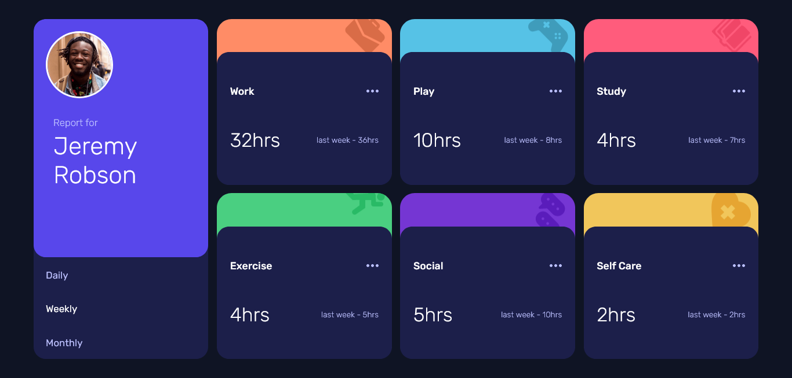

# Frontend Mentor - Time tracking dashboard solution

This is a solution to the [Time tracking dashboard challenge on Frontend Mentor](https://www.frontendmentor.io/challenges/time-tracking-dashboard-UIQ7167Jw). Frontend Mentor challenges help you improve your coding skills by building realistic projects.

## Table of contents

- [Frontend Mentor - Time tracking dashboard solution](#frontend-mentor---time-tracking-dashboard-solution)
  - [Table of contents](#table-of-contents)
  - [Overview](#overview)
    - [The challenge](#the-challenge)
    - [Screenshot](#screenshot)
    - [Links](#links)
  - [My process](#my-process)
    - [Built with](#built-with)
    - [What I learned](#what-i-learned)
  - [Author](#author)

## Overview

### The challenge

Users should be able to:

- View the optimal layout for the site depending on their device's screen size
- See hover states for all interactive elements on the page
- Switch between viewing Daily, Weekly, and Monthly stats

### Screenshot



### Links

- [Code Source](https://github.com/zougari47/time-tracking-dashbord)
- [Live Demo](https://time-tracking-dashbord.netlify.app/)

## My process

### Built with

- Mobile-first workflow
- [React](https://reactjs.org/) - JS library
- [SASS](https://sass-lang.com//) - CSS preprocessor
- Grid / Flexbox

### What I learned

This challenge was really test of my React and SASS skills, I pull the data from JSON file and use radio buttons to toggle between the property.

check out this snippet how I change icons and background with SASS 🔥

```SCSS
$backgrounds-img: '2' '/img/icon-work.svg' $Light-red-work,
  '3' '/img/icon-play.svg' $Soft-blue,
  '4' '/img/icon-study.svg' $Light-red-study,
  '5' '/img/icon-exercise.svg' $Lime-green,
  '6' '/img/icon-social.svg' $Violet,
  '7' '/img/icon-self-care.svg ' $Soft-orange;

@each $index, $path, $color in $backgrounds-img {
  .small-cards:nth-child(#{$index}) {
    background-color: #{$color};
    background-image: url(#{$path});
    // box-shadow: rgba($color, 0.2) 0px 3px 8px;
  }
}

```

Snippet of cards component 😍

```js
function SmallCards({ time }) {
  const cards = data.map((obj, idx) => {
    return (
      <div className="small-cards" key={idx}>
        <div className="infos-container">
          <div className="info-container">
            <div className="title">
              <span>{obj.title}</span>
              <IconMenu />
            </div>
            <div className="statistic">
              <span className="hours">{obj.timeframes[time].current}hrs</span>
              <span className="last-week">
                last week - {obj.timeframes[time].previous}hrs
              </span>
            </div>
          </div>
        </div>
      </div>
    );
  });

  return <>{cards}</>;
}
```

## Author

- Frontend Mentor - [@zougari47](https://www.frontendmentor.io/profile/zougari47)
- Twitter - [@zougari47](https://www.twitter.com/zougari47)
- codepen - [@zougari47](https://codepen.io/zougari47)
